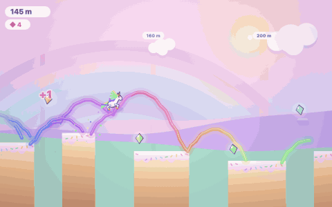

# HOOFBEAT

Entrée [js13kGames 2026](https://js13kgames.com), thème *Unicorns and Rainbows*.
Un jeu web complet dans une archive zip de 13 Ko, sans aucun fichier externe.

## Le principe

Tu ne peux qu'avancer. Ta traînée arc-en-ciel est enregistrée pendant chaque vol.
Au run suivant, elle devient **solide**.

Certains gouffres dépassent volontairement la portée d'un saut : ils sont
mathématiquement infranchissables du premier coup. Il faut sauter dedans, mourir,
et se servir de l'arc qu'on vient d'y laisser comme d'un pont. **On meurt pour
construire le chemin.**



## Démarrer

Ouvre `index.html` dans un navigateur. Aucune installation, aucun serveur.

## Contrôles

| touche | action |
|---|---|
| Espace, Flèche haut, W, Z, clic, toucher | sauter ; maintenir pour planer une fois GLIDE acheté |
| Shift, X, bouton rond en bas à gauche | ruée, une fois DASH acheté |
| A | ouvrir la boutique |
| R | rembobiner après une mort, une fois REWIND acheté |
| N, deux fois | nouveau monde |
| M | couper le son |
| Échap | quitter la boutique |

## Compiler

```bash
nvm use            # version de Node dans .nvmrc
npm install        # terser et roadroller, versions figées par package-lock.json
npm run build      # build rapide, un tirage roadroller
npm run build:final   # build à soumettre : roadroller -O2, meilleur de trois tirages
```

Chaîne : extraction du script, `terser`, `roadroller`, `zip -9`, `advzip`
(zopfli, si `advancecomp` est installé), puis mesure du budget. Livrables :

- `hoofbeat.zip` à la racine, l'archive à soumettre, avec `index.html` à sa racine ;
- `dist/js13k/index.html`, la même page, pour tester dans un navigateur.

La taille du zip change d'un build à l'autre : roadroller tire ses paramètres
au hasard. Lire le chiffre imprimé par le build, pas un chiffre noté ici.

`--strip-dev` retire physiquement le panneau de débogage et le pilote
automatique, délimités par les marqueurs `//<DEV>` et `//</DEV>`. C'est la
version à soumettre.

Sans l'option, le build conserve le panneau : pratique pour tester, trop gros
pour le concours.

## Tester

```bash
bash test.sh              # les douze suites sur index.html
node tests/fx.js          # une suite en particulier
```

Chaque suite accepte un fichier en argument, ce qui permet de valider une
variante : `node tests/trail.js autre.html`.

| suite | ce qu'elle verrouille |
|---|---|
| `headless.js` | le jeu tourne 1800 frames dans les cinq modes, sans navigateur |
| `tunnel.js` | on ne traverse jamais un pont, de 200 à 2600 px/s, ruée comprise |
| `trail.js` | le ruban n'a aucun trou : en vol, tout bucket traversé est enregistré |
| `terrain.js` | le décor du sol ne scintille pas quand la caméra avance |
| `ladder.js` | l'échelle des dix drapeaux, bouclier, tir, rembobinage, New Game + |
| `fx.js` | un effet par pouvoir, et seulement quand il est actif |
| `party.js` | les noms des pouvoirs verrouillés restent cachés, la fête se déclenche |
| `attract.js` | l'écran d'accroche joue seul et n'écrit rien dans la sauvegarde |
| `music.js` | la grille de BUBBLEGUM POP, et la survie sans `AudioContext` |
| `dev.js` | les cinq actions du panneau de débogage |
| `auto.js` | le pilote enchaîne les parties, achète, et se sert des pouvoirs |
| `seeds.js` | 40 mondes aléatoires : équité et respect du curriculum |

Les suites utilisent un contexte `vm` avec un canvas factice. Aucune dépendance,
aucun navigateur.

## Architecture

Le niveau est un tableau indexé par « bucket » de 8 px. Le coureur n'avance que
vers la droite, donc **une traînée est une fonction pure de x** : un `y` par
bucket. Collision en O(1), mémoire minuscule, sérialisation triviale.

Portée d'un saut : `2 × 470 / 1500 × 270` = 169 px, soit 21 buckets. La
génération produit des gouffres de 25 à 37 buckets.

La collision balaie chaque frame en sous-pas et interpole la hauteur entre deux
échantillons : sans ça on traverse les ponts en ruée ou à faible cadence.

La chute mortelle se mesure à 220 px sous le **terrain** local, jamais sous une
traînée : les rubans s'empilent vers le ciel au fil des runs, et les prendre
comme référence tuerait en plein vol.

## Curriculum

Une seule nouveauté à la fois, calée sur les drapeaux.

| jusqu'à | ce qui apparaît |
|---|---|
| 100 m | rampe d'apprentissage : gouffres étroits, longues plateformes |
| 250 m | les gouffres durs, donc le mécanisme de la traînée |
| 250 m, drapeau 1 | les pics |
| 500 m, drapeau 2 | plateformes plus courtes, gouffres plus larges |
| 750 m, drapeau 3 | les corbeaux |

Les dix drapeaux, tous les 10 % du parcours, ouvrent une famille de pouvoirs :
mémoire, double saut, plané, bouclier, ruée, tir, changement de monde, pelage,
rembobinage, New Game +. Leur nom reste caché tant qu'ils ne sont pas franchis.

## Sauvegarde

`localStorage`, avec un miroir en mémoire pour les environnements qui le
refusent. La graine du monde est persistée : un même joueur retrouve son
parcours et ses traînées. Le bouton NEW WORLD tire une graine neuve.

## Panneau de débogage

Le bouton **DEV**, en bas à droite, ouvre cinq actions : effacer la sauvegarde,
tout débloquer, avancer de 1000 m, activer le pilote automatique, fermer.

Le pilote enchaîne les parties, achète du moins cher au plus cher, se sert du
plané et de la ruée, et rembobine pour prolonger un run. Il sert aux captures.

## Outils

- `tools/music.html` : les huit musiques auditionnées avant de choisir
  BUBBLEGUM POP. Tout est synthétisé, aucun fichier audio.
- `tools/ground.html` : les six sols comparés côte à côte, avec la même découpe
  de terrain et une licorne pour l'échelle.

## Licence

À choisir avant publication. js13kGames demande que le code source soit public.
